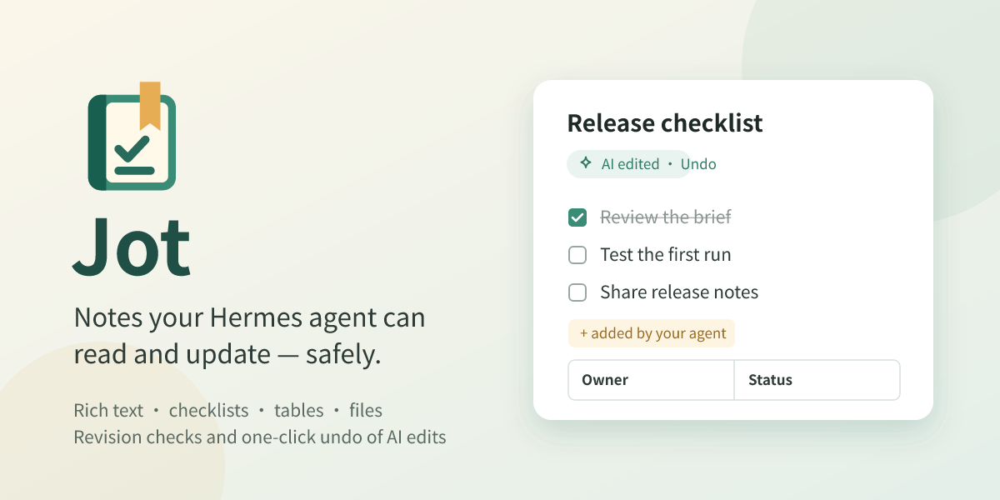

# Jot for Hermes

[简体中文](README.zh-CN.md) · [Guide and permissions](docs/GUIDE.en.md) · [Validation](docs/VALIDATION.md)



**Keep notes, checklists and documents beside Hermes. Edit them yourself; turn on AI collaboration and your agent can read and update them too. Agent edits use revision checks. For an existing note, undo restores the whole note to before the agent's latest round of changes.**

> Catalog submission pending. Native macOS Desktop and agent checks are recorded in [validation](docs/VALIDATION.md), together with platform limits.

## Features

- A full workspace and a panel beside conversations, with title/body search, pinned notes and recent changes.
- Headings, bold, italic, underline, lists, checklists, quotes, code, text colors and highlighting.
- Tables with row/column actions, draggable column widths and automatic fitting.
- Optional, user-named folders; sorting, multi-selection, duplication, moving and Trash.
- Images, file attachments and selected-text capture, with preview, download and default-application actions.
- TXT, Markdown, PDF and Word (DOCX) export, including folder-organized archives of multiple notes.
- Import Markdown and text files, or a ZIP such as Jot's own library export, with folders and linked files.
- Optional agent collaboration: find, read, create, edit precisely, append, check tasks and move notes to Trash. Human editors can undo the latest run of AI changes to an existing note.

## Working with your agent

Turn on **Allow AI collaboration** at the bottom of the note list. When you ask, Hermes can then search, read and change your notes through six `jot_*` tools.

- **Ask Hermes about this note** (in the note menu and toolbar) puts a reference to the open note into the message box, so the agent knows which note you mean. Beside a conversation it lands in that conversation's message box; when no message box is open, it is copied for pasting.
- The agent reads a note as Markdown and changes it with exact find-and-replace edits, so tables, images, colors and other formatting around a change stay as they were. Rewriting a whole note is refused when Markdown cannot represent everything in it, unless you agree to lose that formatting.
- Changes the agent makes appear in an open Jot panel right away. If you are typing in a note when the agent adds to its end, the new blocks join your draft instead of raising a conflict.
- Notes the agent changed are marked. For an existing note, **Undo AI edits** restores the whole note to before the latest round of consecutive agent edits; it does not undo individual changes one by one. Notes newly created by the agent have no earlier version to restore.

## In Hermes

Write in a full workspace:


Keep a note beside a conversation and ask the agent to add to it. Here **Ask Hermes about this note** passed the note to the agent, which appended two checklist items; Jot marks the note **AI edited**:


Captured in the real host with synthetic demo notes and conversations; no personal project data is shown.

## Human control

AI collaboration starts off. The six tools stay registered with Hermes, so turning collaboration on works in the conversation you already have open; while it is off, every call is refused with a message that tells you where to turn it on, and no tool can enable it. Edits require the current revision. Whole-document text replacement that would discard formatting is blocked by default; the tool contract requires user consent and an explicit formatting-loss acknowledgement to proceed. Precise edits, appending and checklist changes preserve the rest of the document.

Notes are separated by Hermes profile and stored in the host-owned `plugin-data/jot/` directory, outside the plugin installation. Hermes owns model configuration and credentials. Jot needs no extra API key and does not pass keys to its note engine. The tool-access switch does not replace operating-system filesystem permissions.

## Import and portability

Choose **Sort and options → Import notes…** to add Markdown (`.md`, `.markdown`) or text files, or a `.zip` archive. A leading `# Title` becomes the note title; top-level folders in a ZIP become Jot folders, and linked images and files come along as attachments. Jot's own Markdown library export imports back the same way, so an export is a portable copy of your notes. See the [guide](docs/GUIDE.en.md#import) for limits and what an export does not carry.

## Installation

Install directly from this repository while catalog review is pending. The repository includes compiled UI and engine files, so end users do not run npm install or need an npm package.

Requirements: a recent Hermes Desktop/plugin SDK and Hermes-managed Node.js 22.19+. See [validation](docs/VALIDATION.md) for the tested host.

```sh
hermes plugins install https://github.com/Totoro-qaq/hermes-jot
```

Follow the installer prompts, then rescan and enable the Desktop component in Capabilities → Plugins. If the backend is disabled, run `hermes plugins enable jot --no-allow-tool-override`. An already-running backend may need a restart or plugin reload.

The Python backend and Desktop component have separate enable switches. Jot's own AI collaboration switch controls its note tools while keeping human editing available.

For development:

```sh
npm ci
npm run check
hermes --run-module unittest discover -s tests_py -v
hermes plugins validate . --json
```

Run `python3 scripts/check.py --package` for the complete local checks and archive. Developers can install that archive with `python3 scripts/install_local.py --home /path/to/hermes-home --replace`; existing local packages are backed up and note data stays in place. Use a real directory: Desktop unified-package discovery does not follow development symlinks.

## Themes

Jot follows Hermes’ active theme for the workspace, editor and dialogs, including light and dark modes.

## Language

Jot follows the Hermes interface language (Settings → Appearance → Language): English, 简体中文, 繁體中文, 日本語, العربية (right to left), Русский, Français, Deutsch and Español. Other Hermes languages show Jot in English. Notes keep the language and direction they are written in, and library exports name their files and folders in the current language. The main README and demo materials are English-first.

## Entry points and shortcuts

The page, side panel and composer button register through the Hermes SDK. Open Jot, New note and Capture selected text are rebindable commands with no default bindings. `/jot`, `/jot new` and `/jot capture` open the corresponding entry points.

Editing follows ⌘ on macOS and Ctrl on Windows/Linux. System copy, cut, paste and select-all remain intact, alongside undo/redo, bold/italic/underline, note-local find and save.

## Implementation

The document model, persistence, revision protection, attachments and exports reuse [dsh-jot](https://github.com/Totoro-qaq/dsh-jot). A Python adapter connects Hermes authentication, profile routing and tool registration to the bundled Node engine over standard input/output. It opens no additional server port. The export and import libraries load only for those requests, unchanged-library checks are answered without starting the engine, and Hermes' plugin event bridge tells open Jot panels when notes change.

The rich editor runs inside the official opaque-origin `SandboxedFrame`. The surrounding note workspace and host actions use the SDK. The editor has no host credentials, native filesystem bridge or network access; it exchanges a bounded set of editing messages only with its owning parent component.

There is no separate Web Dashboard UI, cloud synchronization, OCR, multi-user live editing or handwriting canvas. See the [guide](docs/GUIDE.en.md) for limits.

## License

MIT. Original Jot source and visual-asset provenance is recorded in [UPSTREAM.json](UPSTREAM.json). The offline Chinese PDF fonts include their licenses, and bundled dependency licenses accompany the package.
