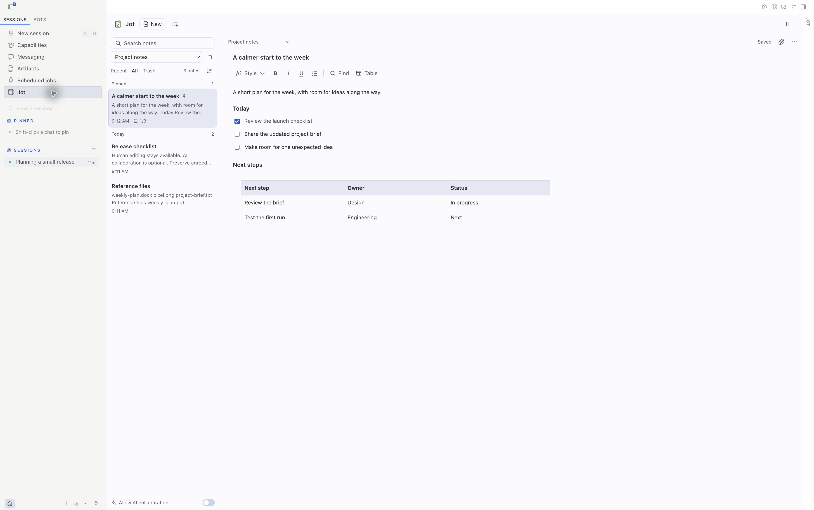
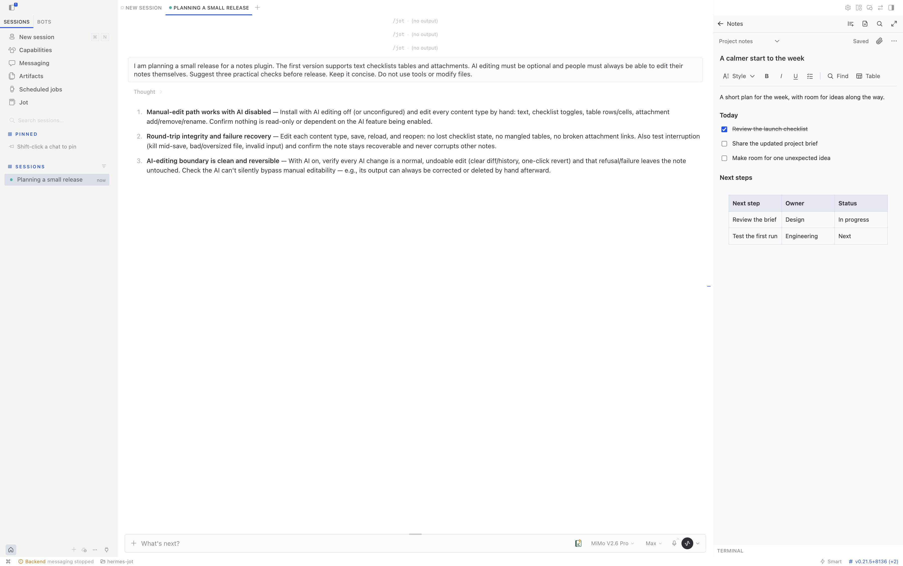

# Jot for Hermes

[简体中文](README.zh-CN.md) · [Guide and permissions](docs/GUIDE.en.md) · [Validation](docs/VALIDATION.md)


**Keep notes, checklists and documents beside Hermes. Edit them yourself, and invite your agent when useful.**

> Local candidate: native macOS Desktop and agent checks completed. Public repository creation and catalog submission remain a separate decision. See [validation](docs/VALIDATION.md) for scope and platform limits.

## Features

- A full workspace and a panel beside conversations, with title/body search, pinned notes and recent changes.
- Headings, bold, italic, underline, lists, checklists, quotes, code, text colors and highlighting.
- Tables with row/column actions, draggable column widths and automatic fitting.
- Optional, user-named folders; sorting, multi-selection, duplication, moving and Trash.
- Images, file attachments and selected-text capture, with preview, download and default-application actions.
- TXT, Markdown, PDF and Word (DOCX) export, including folder-organized archives of multiple notes.
- Optional agent collaboration: find, read, create, append, check tasks and move notes to Trash. Human editors can undo the latest run of AI changes to an existing note.

## In Hermes

Write in a full workspace:



Keep a note beside a conversation:



Captured in the real host with synthetic demo notes and conversations; no personal project data is shown.

## Human control

AI collaboration starts off. Every Jot tool checks the switch, and the tools cannot enable it. Edits require the current revision. Whole-document text replacement that would discard rich formatting is blocked by default. The tool contract requires user consent and an explicit formatting-loss acknowledgement to proceed; appending preserves the existing document.

Notes are separated by Hermes profile and stored in the host-owned `plugin-data/jot/` directory, outside the plugin installation. Hermes owns model configuration and credentials. Jot needs no extra API key and does not pass keys to its note engine. The tool-access switch does not replace operating-system filesystem permissions.

## Local installation

This is currently a local development package. The package includes compiled UI and engine files, so end users do not run npm install.

Requirements: a recent Hermes Desktop/plugin SDK and Hermes-managed Node.js 22.19+. See [validation](docs/VALIDATION.md) for the tested host.

1. Put the complete package in `plugins/jot/` under the active Hermes data directory.
2. Run `hermes plugins validate /path/to/jot`.
3. Run `hermes plugins enable jot --no-allow-tool-override`.
4. Rescan and enable the Desktop component in Capabilities → Plugins. An already-running backend may need a restart or plugin reload.

The Python backend and Desktop component have separate enable switches. Jot's own AI collaboration switch controls its note tools while keeping human editing available.

For development:

```sh
npm ci
npm run check
hermes --run-module unittest discover -s tests_py -v
hermes plugins validate . --json
```

Run `python3 scripts/check.py --package` for the complete local checks and archive. Developers can install that archive with `python3 scripts/install_local.py --home /path/to/hermes-home --replace`; existing local packages are backed up and note data stays in place. Use a real directory: Desktop unified-package discovery does not follow development symlinks.

## Themes

Jot follows Hermes’ active theme for the workspace, editor and dialogs, including light and dark modes.

## Language

Jot starts in English. Choose **Sort and options → Interface language → 简体中文** to switch to Chinese; the choice is remembered for Jot without changing Hermes. Notes keep the language you write them in. The main README and demo materials are English-first.

## Entry points and shortcuts

The page, side panel and composer button register through the Hermes SDK. Open Jot, New note and Capture selected text are rebindable commands with no default bindings. `/jot`, `/jot new` and `/jot capture` open the corresponding entry points.

Editing follows ⌘ on macOS and Ctrl on Windows/Linux. System copy, cut, paste and select-all remain intact, alongside undo/redo, bold/italic/underline, note-local find and save.

## Implementation

The document model, persistence, revision protection, attachments and exports reuse [dsh-jot](https://github.com/Totoro-qaq/dsh-jot). A Python adapter connects Hermes authentication, profile routing and tool registration to the bundled Node engine over standard input/output. It opens no additional server port.

The rich editor runs inside the official opaque-origin `SandboxedFrame`. The surrounding note workspace and host actions use the SDK. The editor has no host credentials, native filesystem bridge or network access; it exchanges a bounded set of editing messages only with its owning parent component.

There is no separate Web Dashboard UI, cloud synchronization, OCR, multi-user live editing or handwriting canvas. See the [guide](docs/GUIDE.en.md) for limits.

## License

MIT. Original Jot source and visual-asset provenance is recorded in [UPSTREAM.json](UPSTREAM.json). The offline Chinese PDF fonts include their licenses, and bundled dependency licenses accompany the package.
