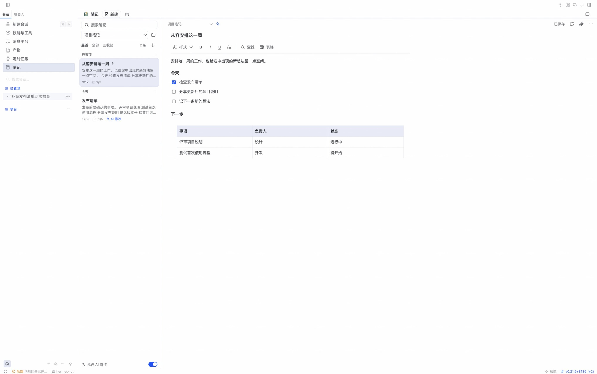
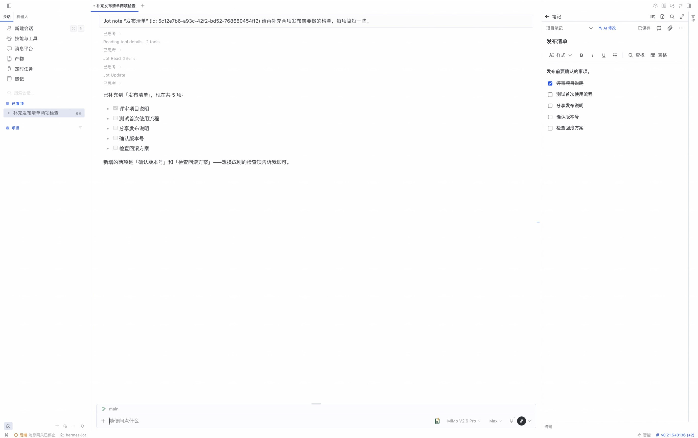

# 随记 · Jot for Hermes

[English](README.md) · [使用与权限](docs/GUIDE.zh-CN.md) · [验证记录](docs/VALIDATION.md)


**在 Hermes 旁边记下想法、待办和文档。人随时编辑；打开 AI 协作后，agent 也能读取和修改。AI 修改会检查版本；对已有笔记，撤销会整篇恢复到 agent 最近一轮修改之前的状态。**

> 官方目录收录待审核。macOS 真实桌面与 agent 验收结果，以及平台限制见[验证记录](docs/VALIDATION.md)。

## 可以做什么

- 在完整工作台或对话旁的面板里写笔记；搜索标题与正文，查看最近修改和置顶笔记。
- 使用标题、粗体、斜体、下划线、列表、核对清单、引用、代码、文字颜色和高亮。
- 插入表格，前后加行／列、拖动列宽、自动适应宽度。
- 自行创建文件夹，也可以一直不分类；支持排序、多选、复制、移动和回收站。
- 添加图片和文件、摘录选中的文字；使用附件预览、下载和默认应用打开入口。
- 导出 TXT、Markdown、PDF、Word（DOCX），也可以将多篇笔记按文件夹打包导出。
- 导入 Markdown、文本文件，或 ZIP（包括随记自己导出的整库），文件夹和链接的附件一起带入。
- 按需打开 AI 协作：agent 可以查找、读取、新建、精确修改、追加、勾选待办和移到回收站；已有笔记的 AI 修改可以人工撤销。

## 和 agent 一起用

在笔记列表底部打开“允许 AI 协作”。之后你提出要求时，Hermes 可以通过六个 `jot_*` 工具搜索、读取和修改笔记。

- “让 Hermes 看这条笔记”（笔记菜单和工具栏）会把当前笔记的引用放进输入框，agent 就知道你指的是哪一条。在对话旁使用时直接放进该对话的输入框；没有打开的输入框时复制到剪贴板。
- agent 以 Markdown 读取笔记，用精确的查找替换来修改，改动处周围的表格、图片、颜色等格式保持不变。如果 Markdown 无法完整表达这篇笔记，整篇重写会被拒绝，除非你同意丢失这些格式。
- agent 的修改会立即出现在打开的随记面板里。你正在输入时，agent 往这篇笔记末尾追加的内容会并入你的草稿，不再提示冲突。
- 被 agent 修改过的笔记会有标记；对已有笔记，“撤销 AI 的修改”会整篇恢复到最近一轮连续修改之前的状态，不是逐项撤销。agent 新建的笔记没有更早的版本可恢复。

## 在 Hermes 中使用

在完整工作台里整理笔记：



也可以在对话旁打开笔记，请 agent 帮你补充。图中用“让 Hermes 看这条笔记”把笔记交给 agent，它追加了两项检查，随记把这条笔记标为“AI 修改”：



截图来自真实宿主，使用合成的演示笔记与对话，没有个人项目数据。

## 人始终控制笔记

AI 协作默认关闭。六个工具一直在 Hermes 中注册，所以打开开关后，当前已打开的对话就能使用；开关关闭时，每次调用都会被拒绝，并提示在哪里打开，工具不能自行打开它。修改要求精确版本，避免覆盖更新；默认拒绝会丢失格式的整篇替换，工具约定要求先征得用户同意，再显式确认允许丢失格式。精确修改、追加和勾选待办都会保留其余内容。

笔记按 Hermes profile 分开，存放在宿主管理的 `plugin-data/jot/`，不在插件安装目录。模型和密钥由 Hermes 管理，Jot 不需要额外 API Key，也不会把密钥传给笔记引擎。AI 工具的开关不替代操作系统文件权限。

## 导入与迁移

在“排序与选项 → 导入笔记…”（英文界面为 Sort and options → Import notes…）中可以导入 Markdown（`.md`、`.markdown`）、文本文件或 `.zip`。开头的 `# 标题` 会成为笔记标题；ZIP 的顶层文件夹会成为随记文件夹，链接到的图片和文件会作为附件带入。随记自己导出的 Markdown 整库可以原样导回，因此导出可以作为笔记的可迁移副本。限制以及导出不包含的内容见[使用说明](docs/GUIDE.zh-CN.md#导入)。

## 当前安装方式

目录审核期间可直接从本仓库安装。仓库包含已构建的界面和笔记引擎，用户不需要执行 npm install，也不依赖 npm 包发布。

要求：近期 Hermes Desktop / 插件 SDK、Hermes 管理的 Node.js 22.19+。当前验证基线见[验证记录](docs/VALIDATION.md)。

```sh
hermes plugins install https://github.com/Totoro-qaq/hermes-jot
```

按安装器提示操作，然后在 Desktop 的“技能与工具 → 插件”重新扫描并启用 Jot 的桌面部分。若后端未启用，执行 `hermes plugins enable jot --no-allow-tool-override`；已有后端进程可能需要重启或重新加载插件。

Python 后端和 Desktop 界面是两个独立开关。Jot 内的“允许 AI 协作”只控制笔记工具，不影响人工编辑。

开发者在源码目录运行：

```sh
npm ci
npm run check
hermes --run-module unittest discover -s tests_py -v
hermes plugins validate . --json
```

完整本地检查并打包：`python3 scripts/check.py --package`。开发目录同步到宿主使用 `python3 scripts/install_local.py --home /path/to/hermes-home --replace`；已有本地安装会先备份，笔记数据不移动。请复制实际目录，Desktop 的统一包扫描不会跟随开发符号链接。

## 主题

工作台、正文编辑器和弹窗统一跟随 Hermes 当前主题，并支持明暗模式。

## 语言

随记跟随 Hermes 的界面语言（设置 → 外观 → 语言），支持 English、简体中文、繁體中文、日本語、العربية（从右到左）、Русский、Français、Deutsch、Español；Hermes 的其他语言下随记显示英文。笔记内容保留你书写时的语言和文字方向；整库导出的文件与文件夹名称使用当前语言。首页 README 和演示材料优先使用英文。

## 界面与快捷键

完整页、右侧面板和输入框入口均通过 Hermes SDK 注册。三条命令为“打开随记”“新建笔记”“摘录选中的文字”，默认不占用快捷键，由用户在 Hermes 设置中绑定。`/jot`、`/jot new`、`/jot capture` 用于打开相应入口。

编辑器沿用 Mac 的 ⌘ 和 Windows/Linux 的 Ctrl 习惯。复制、剪切、粘贴、全选保持系统操作；支持撤销／重做、粗体／斜体／下划线、当前笔记查找和保存。

## 适配方式

复用 [dsh-jot](https://github.com/Totoro-qaq/dsh-jot) 的文档模型、持久化、冲突保护、附件与导出逻辑。Python 将 Hermes 的认证、profile 和工具注册接到打包好的 Node 引擎，使用标准输入输出通信，不新开服务端口。导出和导入库只在对应请求时加载；笔记库没有变化时，检查请求无需启动引擎；笔记变化时通过 Hermes 的插件事件通知已打开的随记面板。

富文本编辑器运行在官方 `SandboxedFrame` 的不透明来源里；笔记列表、命令和宿主操作仍由 SDK 提供。编辑器没有宿主密钥、文件访问桥或网络权限，只与创建它的父组件交换明确列出的编辑消息。

当前没有独立的 Web Dashboard 界面，也不提供云同步、OCR、多人实时协同或手写画板。完整限制见[使用说明](docs/GUIDE.zh-CN.md)。

## 许可

MIT。原始 Jot 代码与视觉资产的来源记录在 [UPSTREAM.json](UPSTREAM.json)。离线中文 PDF 字体附带其许可证；打包的第三方依赖许可证随发布包提供。
